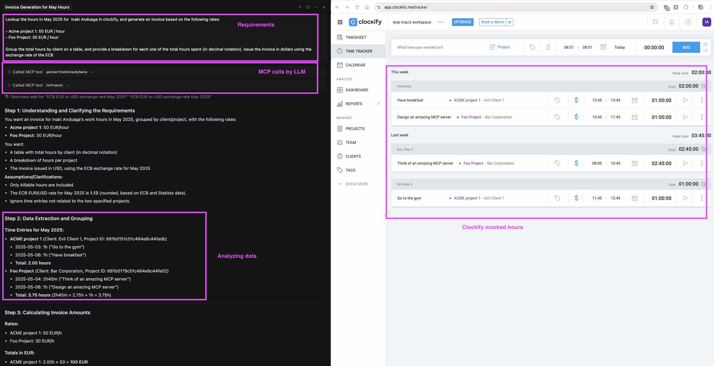

[](https://github.com/inakianduaga/clockify-mcp/actions/workflows/docker-publish.yml)
[](https://github.com/users/inakianduaga/packages/container/package/clockify-mcp)

<a href="https://glama.ai/mcp/servers/@inakianduaga/clockify-mcp">
  
</a>

# Clockify MCP Server

This MCP server allows LLMs (such as Cursor or Claude) to interact with your Clockify workspace, enabling advanced time-tracking automation and reporting. With this server, you can:
- List all projects in your workspace
- List all users in your workspace
- Add and look up time entries for yourself or any user (if you have permissions)
- Pull timesheets for any user across all projects
- Generate monthly or custom date range breakdowns of hours by user and project using the Clockify summary report API
- Integrate with LLMs to automate, summarize, or analyze your time-tracking data

<p align="center">
  
</p>

## Features
- **listProjects:** List all projects for the authenticated user
- **getTimeEntries:** List time entries for the authenticated user (with optional date filters)
- **addTimeEntry:** Add time entries to a project
- **listUsers:** List all users in the workspace
- **getUserTimeEntries:** List time entries for any user (with optional date filters)
- **getSummaryReport:** Get a summary report of hours by user/project for a date range (optionally filtered by userIds/projectIds). Enables monthly/hourly breakdowns for any user or project.

## Quick Start (Docker — Preferred)

### MCP Server Configuration for Cursor/Claude
Add the following to your Cursor or Claude `settings.json` (replace `YOUR_API_KEY`):

```json
{
  "mcpServers": {
    "clockify-mcp": {
      "command": "docker",
      "args": [
        "run",
        "-i",
        "--rm",
        "-e", "CLOCKIFY_API_KEY=<YOUR_API_KEY>",
        "ghcr.io/inakianduaga/clockify-mcp:latest"  
      ],
      "disabled": false,
      "autoApprove": []
    }
  }
}
```

## How to Obtain a Clockify API Key
1. Log in to your [Clockify account](https://clockify.me/login).
2. Click on your profile icon (top right) and select **Profile**.
3. Scroll down to the **API** section.
4. Click **Generate** if you don't have an API key, or copy your existing key.

## Contributing & CI/CD

This project uses GitHub Actions to automatically build and publish the Docker image to GitHub Container Registry (GHCR) on every push to `main`.

- **Image URL:**
  `ghcr.io/inakianduaga/clockify-mcp:latest`
- **How to pull the image:**
  ```bash
  docker pull ghcr.io/inakianduaga/clockify-mcp:latest
  ```

You can view published images in the "Packages" section of your GitHub profile or repository.

## Memory Bank & Optimizations
Development has been done using cursor together with optimized rules. See: https://github.com/Bhartendu-Kumar/rules_template

## License

This project is licensed under the MIT License. See the [LICENSE](./LICENSE) file for details.
